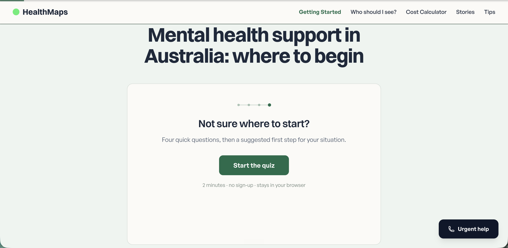
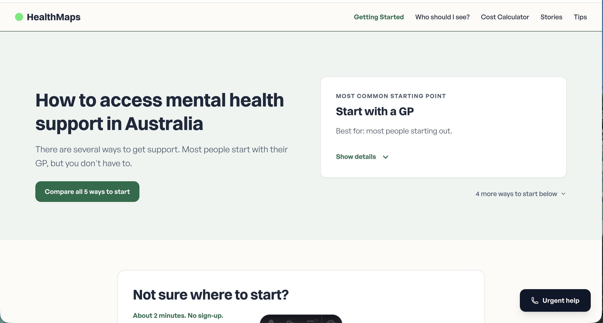
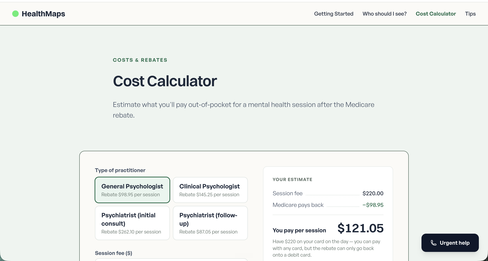

# HealthMaps — Task list for autonomous cloud sessions

Source of truth: Jethro's Obsidian task note, copied here so cloud sessions can see it.
Last synced from the note: 2026-07-16.

## Instructions for autonomous sessions

- **Work on a fresh branch and open a PR. Never commit or push to `main`** — Netlify auto-deploys `main` straight to healthmaps.com.au, so touching main is a live deploy.
- **Pick ONE task per run.** Don't chain tasks.
- Tags:
  - `[cloud-ok]` — copy, content, or structural work that can be fully verified from code alone. Verify with `npx astro check` and `npm run build` before opening the PR.
  - `[visual-check]` — visual/layout/interaction work you cannot fully verify yourself. You may attempt it: run `npm run dev` and use a headless browser (e.g. Playwright) to screenshot your work at desktop and 375px-wide mobile. Describe (or attach) the screenshots in the PR, and state clearly that the PR needs Jethro's visual review on the Netlify deploy preview before merging.
- Follow `CLAUDE.md` and the rules in `.claude/rules/` (design tokens, typography, spacing, pencil-border system). All colours from `@theme` tokens; no JS frameworks; Australian context.
- Health content rules apply: flag any AI-drafted health claims with `<!-- REVIEW -->`; Mental Health Care Plans cannot be "transferred" — a GP must rewrite them.
- When a task is done, tick its checkbox in this file in the same PR.
- Screenshots referenced below live in `docs/tasks/` — they show the state of the site when Jethro logged the task.

## Tasks

### Pathway page (`/pathway`)

- [ ] `[visual-check]` **Grey helper line** — "I don't love the look of the smaller grey font… even though it's simple, it's a bit boxy or AI vibey." Refers to the small grey line "You don't need all of these — most people start with just one." 

- [ ] `[visual-check]` **Quiz call-out** — "Improve the look of the quiz call-out. It looks a bit AI related. I want it to be simple." Refers to the "Not sure where to start?" quiz card. 

- [ ] `[visual-check]` **Pathways page overall** — "Improve look of the pathways page so it looks less AI vibe. Maybe more simple." 

- [x] `[cloud-ok]` **Quiz question copy** — "Check over the copy of the questions. Optimise them." (The pathway quiz questions.) — done 2026-07-14 in commit `83754de` (see `docs/plans/quiz-copy-pass.md`); checkbox was just stale.

- [ ] `[visual-check]` **Green logo-style dots** — "Make green logo style dots, arty, homemade, for the website emojis." (Replace emoji usage across the site with hand-made green dot marks in the logo's style.)

- [ ] `[visual-check]` **GP card auto-scroll bug** — the GP card on the pathway page has an unwanted auto-scroll behaviour. (Not in the note — added from Jethro's description; only this one line of detail exists. Interaction bug, hard to reproduce headlessly — attempt at your own risk and describe in the PR exactly what you could and couldn't reproduce.)

- [ ] `[visual-check]` **Void below timeline illustration** — there's an empty void below the timeline illustration. (Not in the note — added from Jethro's description; only this one line of detail exists.)

### Cost calculator (`/calculator`)

Screenshot for all calculator tasks: 

- [ ] `[cloud-ok]` **Too wordy / AI-like** — "Cost calculator too wordy and AI like, and too many stats etc." Trim the copy and stat clutter.

- [x] `[cloud-ok]` **Clinical vs general psychologist** — "People won't know the difference between clinical/general psychologist. Need to solve that somehow."

- [ ] `[visual-check]` **First green line** — "Don't like the first green line." (Likely the green "COSTS & REBATES" section label at the top of the page, or the first green rule/accent in the calculator — confirm visually before changing.)

- [ ] `[visual-check]` **Gamified price input** — "Should be extremely easy to change price — or even satisfying/gamified, like you pull a border across or scroll it." (The session fee input.)
